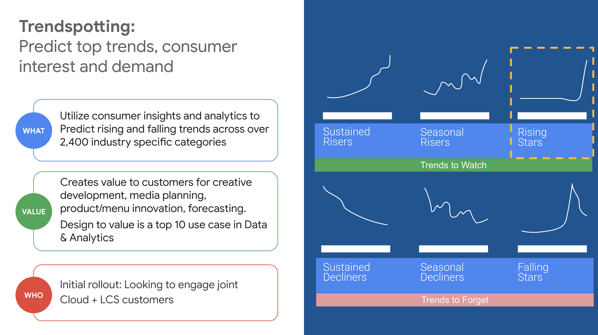
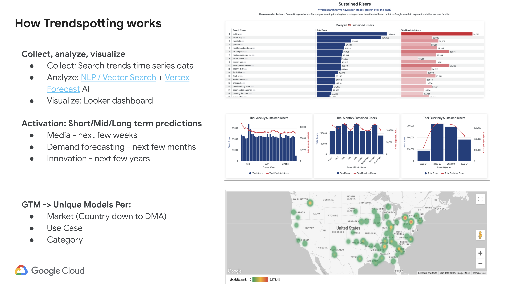
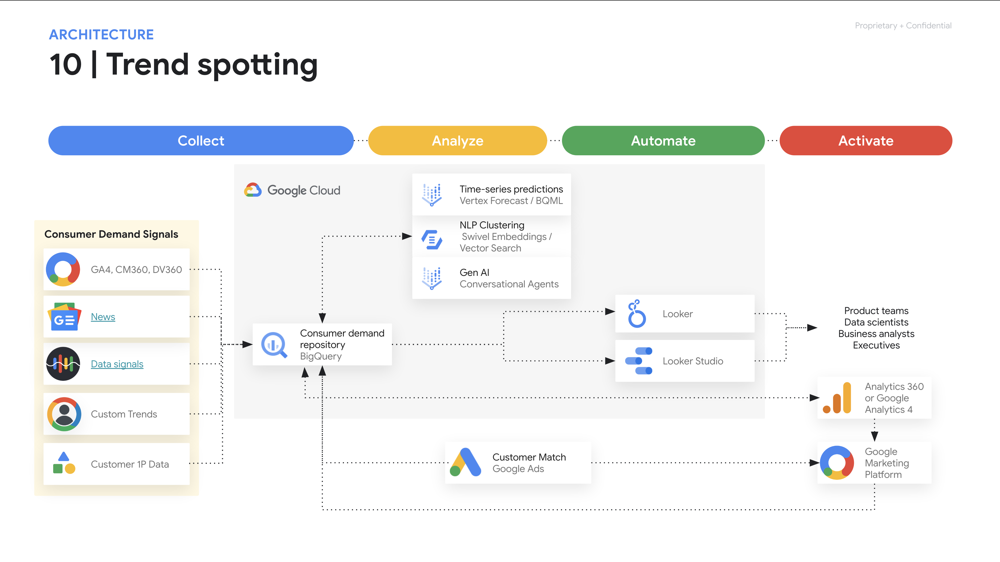
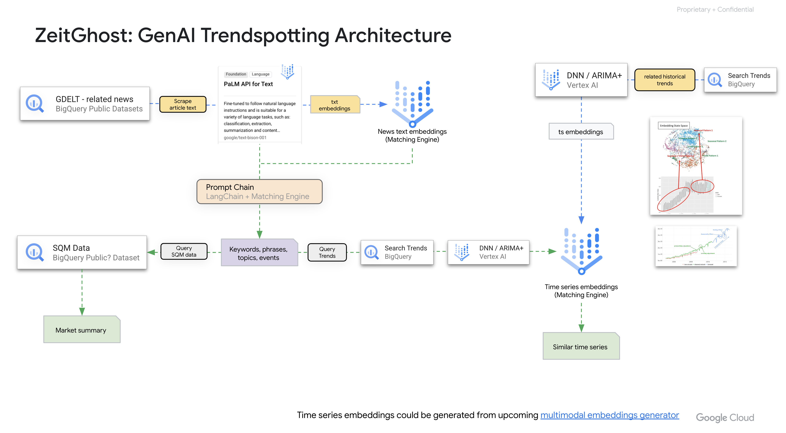

# Trendspotting

## Introduction

Trendspotting is the process of identifying emerging trends. It is a valuable tool for businesses, as it can help them to stay ahead of the competition and to make informed decisions about their future.

This project provides an implementation of Trendspotting on Google Cloud. The project is divided into two parts:

* A data collection and preprocessing pipeline that collects data from a variety of sources and preprocesses it for training.
* A machine learning model that is trained on the preprocessed data and can be used to identify emerging trends.

The project is designed to be scalable and to be able to handle large amounts of data. It is also designed to be easy to use and to be able to be integrated with other systems.

## Getting Started

To get started with this project, you will need to:

* Create a Google Cloud project.
* Enable the necessary Google Cloud APIs.
* Install the necessary software.
* Clone the project repository.

Once you have completed these steps, you will be able to run the project.

## Running the Project

To run the project, you will need to:

* Create a dataset.
* Import data into the dataset.
* Preprocess the data.
* Train the machine learning model.
* Evaluate the machine learning model.

Once you have completed these steps, you will be able to use the project to identify emerging trends.

## Conclusion

This project provides an implementation of Trendspotting on Google Cloud. The project is designed to be scalable, easy to use, and to be able to be integrated with other systems.

__________________
## Limitations and Licensing

All code in this repository is for demonstration purposes only.

This code is not an official Google product, nor is it part of an official Google product.non-production demo/example code or infrastructure automation scripts

Licensed under the Apache License, Version 2.0 (the "License");
you may not use this file except in compliance with the License.
You may obtain a copy of the License at

    https://www.apache.org/licenses/LICENSE-2.0

Unless required by applicable law or agreed to in writing, software
distributed under the License is distributed on an "AS IS" BASIS,
WITHOUT WARRANTIES OR CONDITIONS OF ANY KIND, either express or implied.
See the License for the specific language governing permissions and
limitations under the License.

__________________
## Overview
This project provides an implementation of Trendspotting on Google Cloud.

## Use Cases

## How it Works

## Architecture Design

Simple Trendspotting architecture on Google Cloud 

Trendspotting Data & ML Orchestration architecture on Google Cloud 

Generative AI Trendspotting architecture on Google Cloud 

